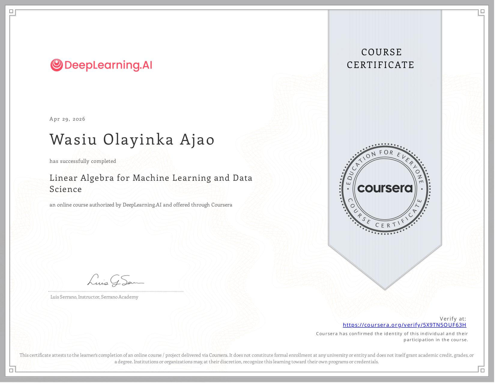

## Today's Focus
- **Phase:** [[Phase 1 - Python & Math]]
- **Goal for today:** Finish assignment for Mathematics for ML and Python crash course 
  
  ---
- ## What I Did
- Finish the last programming assignment for week 4 of the Mathematics for ML(Linear Algebra)
- Completed Python crash course book
- Completed linear algebra part in Mathematics for ML and got a certificate
- ---
- ## What I Learned
- Learned about Variance and Covariance and how they related to spread in a dataset
- Learned about Covariance matrix and how they can be used with Eigenvalues and Eigenvectors for dimensionality reduction
- Learned about projections as a linear transformation(projecting a higher dimension dataset to lower dimention)
- Learn about Principal Component Analysis(PCA) which can be used to reduce dimensionality of datasets without losing too much information
- ---
- ## Bugs & Blockers
- None
- ---
- ## Concepts That Need More Time
- N/A
- ---
- ## Tomorrow
- Finish the week 1 programming labs, ran out of study time while doing it yesterday
- ---
- ## Wins
- Completed week 4 assignment of the Mathematics for ML(Linear Algebra)
- Completed week 1 of Mathematics for ML(Calculus)
- Got a mathematics for Mathematics for ML certificate(first certificate for the year)
- 