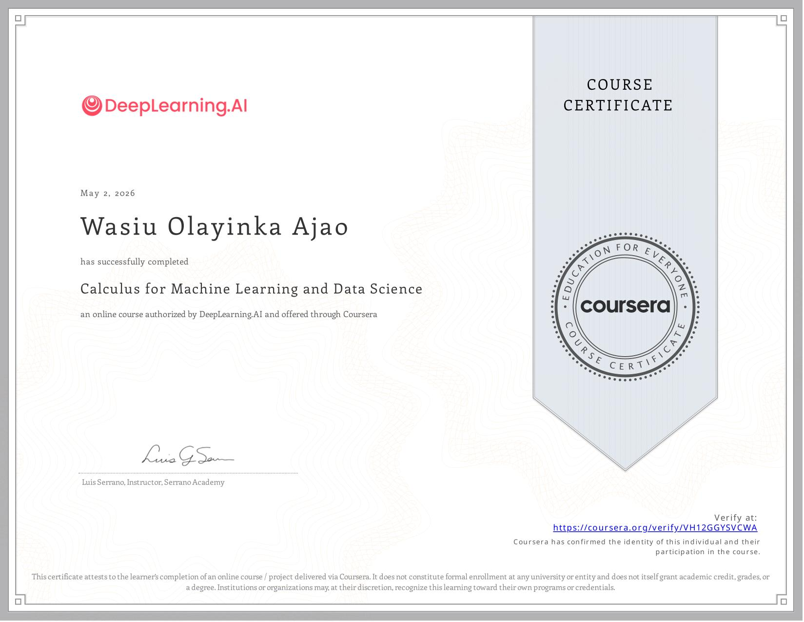

## Today's Focus
- **Phase:** [[Phase 1 - Python & Math]]
- **Goal for today:** Finish Mathematics for ML(Calculus)
  ---
- ## What I Did
- Built single layer and single perceptron machine learning models
- Implemented linear regression and classification problems from scratch using numpy and visualizing using matplotlib
- Implemented a multilayer neural network to solve a classification problem
- ---
- ## What I Learned
- Learned how to use calculus for back propagation in training a neural network with simple layers(input and output, no hidden layer) and multiple perceptron for both linear regression and classification problems
- Learned how to use calculus for back propagation in training a neural network with multilayer(a single hidden layer)
- Learned about Newton's method and its advantages and disadvantages and the comparison between this and the gradient descent method
- Learned about Hessian and Concavity
- Took a sneak peak into how beautiful neural networks actually are and how they can't exist without linear algebra and how they can't learn without calculus. Anticipating what the role of probability and statistics will be on machine learning and neural networks(already seeing how it would play out but yeah, would be great to learn it in the next course)
- ---
- ## Bugs & Blockers
- N/A
- ---
- ## Concepts That Need More Time
- The course basically did this for 2 layer network with maximum of two perceptrons per layer, my Mathematical mind is already thinking of the generalization of this. I would need some time to study the general case, would be monstrous but yeah...
- ---
- ## Tomorrow
- Tomorrow is an off day, would probably play GTA V or hang out with friends.
- ---
- ## Wins
- Completed course Mathematics for ML(Calculus)
- 
- Calculus Note