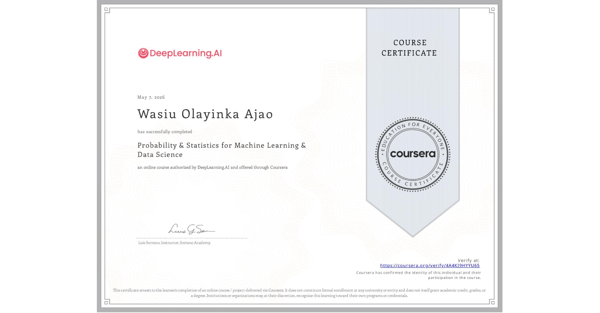
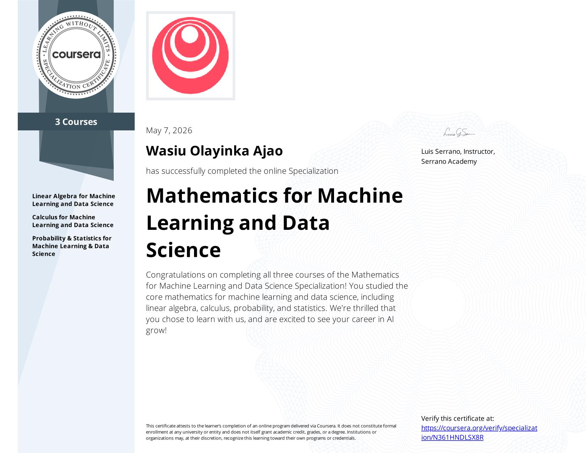

## Today's Focus
- **Phase:** [[Phase 1 - Python & Math]]
- **Goal for today:** Continue Mathematics for ML(Probability and Statistics) and continue Grokking Machine Learning
  ---
- ## What I Did
- Confidence intervals and Hypothesis testing
- Read chapter 4 of Grokking Machine Learning
- ---
- ## What I Learned
- Learned about Confidence Intervals and Margin of Error
- Learned about Hypothesis Testing and its ML application in A/B Testing
- Learned about underfitting and overfitting and methods to solve these problems such as by testing, using complexity graph and using regularization
- ---
- ## Bugs & Blockers
- N/A
- ---
- ## Concepts That Need More Time
- N/A
- ---
- ## Tomorrow
- Take tomorrow to revise everything learned in the Mathematics for Machine Learning and Data Science Specialization
- D
-
- ---
- ## Wins
- Completed the Mathematics for ML(Probability and Statistics)
  Completed the Mathematics for Machine Learning and Data Science Specialization
- 
- 
- Probability and Statistics Notes: [Probably and Statistics Notes.pdf](../assets/Probably_and_Statistics_Notes_1778157093641_0.pdf)
-