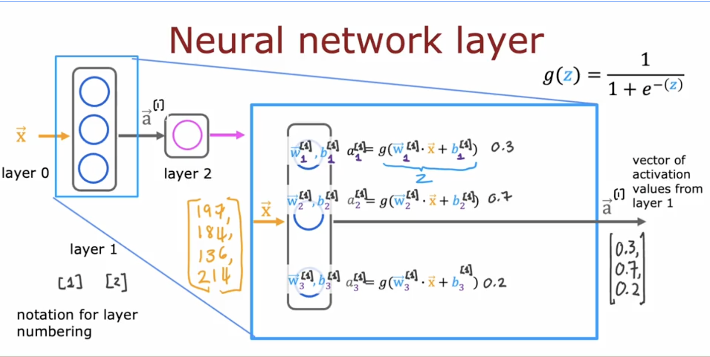
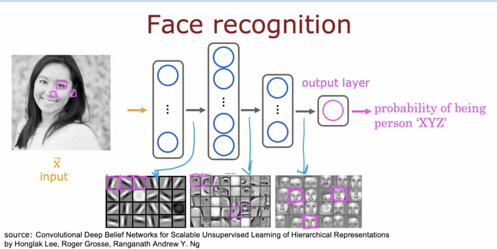

## Today's Focus
- **Phase:** [[Phase 1 - Python & Math]]
- **Goal for today:** Start Machine Learning Specialization(Advanced Learning Algorithms)
  ---
- ## What I Did
- Implemented a neural network in Tensorflow
- Used keras as the interface for Tensorflow
- Created a neural network to identify if a digit is 0 or 1(training dataset from http://yann.lecun.com/exdb/)
- ---
- ## What I Learned
- Neuron is a computational unit which takes a vector of input, computes a weighted sum plus a bias, then apply a non-linear activation function to produce a single output.
- Examples of activation functions are Sigmoid, Softmax, ReLU and Tanh
- Layer is a collection of neurons which receives the same input and computes the output in parallel
- Input layer which receives the raw input features, hidden layers which are intermediate computational values learned from the network and the output layer which is the final layer that produces the preditioion.
- Neural network is a function composed of multiple layers of neurons where the output of each layers becomes the input to the next layer.
- Neural networks are parameterized by the weights and biases of all layers which are learned from the data
- 
- Forward propagation is the process of computing the output of a neural network from a given input.
- For layer $l$
- $$\begin{aligned}
  z^{[l]} &= w^{[l]} * a^{[l-1]} + b^{[l]} \\
  a^{[l]} &= g(z^{[l]})
  \end{aligned}$$
- Backward propagation is the process of computing the gradients of the loss functions for all weights and biases in the network.
- Training is the process of adjusting the parameters of the network by minimizing the cost function on a training dataset, typically using gradient descent and back propagation.
- Inference is the process of using a trained neural network to make predictions on new dataset.
- The parameters from training are frozen and we just apply forward propagation to get the prediction.
- Vectorization is the practice of expressing computations as vectors and matrices rather than explicit loops. It enables use of optimized linear algebra libraries and GPUs.
- Fascinating that neural networks find or creates new features which better represents the output with nobody telling them what to do, they learn it all from the data, like the example of using it to recognize a face below:
- 
-
- ---
- ## Connection
- The sigmoid function used today is the same as the one used in supervised learning course on classification
- I've also implemented a multiplayer network as an assignment in the Mathematics for ML course
- Even though Andrew never went into detail about back propagation maybe because talking about the derivation and intuition will take a while, I have actually done a pretty complex back
-
- ---
- ## Bugs & Blockers
- N/A
- ---
- ## Concepts That Need More Time
- The whole Numpy and Tensorflow data representation disparity
- How to always figure out the best to use and a standard way of representing my input data, like do we use $wx+b$ or $w^{T}x+b$ or $xw+b$
- I mean it depends on how we structure the input data but its still somehow confusing.
- Notion of a tensor, I need to take a look at mathematical tensors and figure out what the motivation for tensorflow is, why can't it be matrixflow 😂
- How to implement backprop for variable network with variable activation function
- ---
- ## Tomorrow
- Continue advanced learning algorithms(course 2 of the machine learning specialization)
- ---
- ## Wins
- Implemented a neural network with 3 layers each with (25, 15 and 1 neurons respectively) to recognize and correctly classify numbers 0 and 1(handwritten digits)