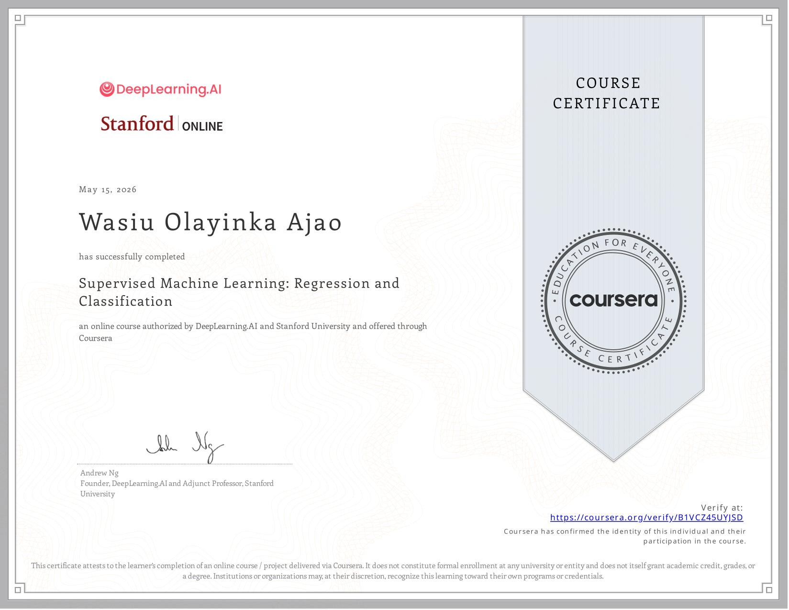

## Today's Focus
- **Phase:** [[Phase 1 - Python & Math]]
- **Goal for today:** Start Machine Learning Specialization(Advanced Learning Algorithms)
  ---
- ## What I Did
- Implemented a neural network in Tensorflow
- Used keras as the interface for Tensorflow
- Created a neural network to identify if a digit is 0 or 1(training dataset from http://yann.lecun.com/exdb/)
- ---
- ## What I Learned
- Neuron is a computational unit which takes a vector of input, computes a weighted sum plus a bias, then apply a non-linear activation function to produce a single output.
- Examples of activation functions are Sigmoid, Softmax, ReLU and Tanh
- Layer is a collection of neurons which receives the same input and computes the output in parallel
- Input layer which receives the raw input features, hidden layers which are intermediate computational values learned from the network and the output layer which is the final layer that produces the preditioion.
- Neural network is a function composed of multiple layers of neurons where the output of each layers becomes the input to the next layer.
- Neural networks are parameterized by the weights and biases of all layers which are learned from the data
- 
- Forward propagation is the process of computing the output of a neural network from a given input.
- Backward propagation is the process of computing the process of the loss functions for all weigh
-
-
- ---
- ## Bugs & Blockers
- N/A
- ---
- ## Concepts That Need More Time
- N/A
- ---
- ## Tomorrow
- Start the advanced learning algorithms(course 2 of the machine learning specialization)
- Read chapter 6 and 7 of the grokking ML book
-
-
- ---
- ## Wins
- Finished supervised machine learning course
- 
- Supervised Machine Learning Notes: [Supervised Machine Learning Notes.pdf](../assets/Supervised_Machine_Learning_Notes_1778851214596_0.pdf)
- [Linear regression implementation](https://colab.research.google.com/drive/16AufFIyGVfYzHykv4xTCd1y9_LNNtz_8?usp=sharing)
- [Logistic regression implementation](https://colab.research.google.com/drive/1B-WS1hkmj5vJQg11yQOVqWUgbPSVpztE?usp=sharing)