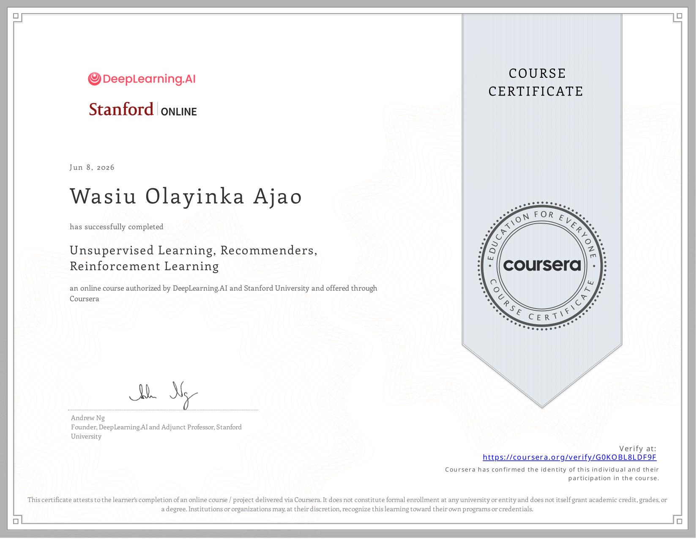

## Today's Focus
- **Phase:** [[Phase 2 - Classical ML]]
- **Goal for today:** Continue the course 3 of the Machine Learning Specialization(Recommender Systems)
  ---
- ## What I Did
- Implemented reinforcement learning for a lunar lander example
- ---
- ## What I Learned
- Reinforcement Learning(RL) trains an agent to take actions in an environment, the agent does not get told what to action correct, it basically gets a reward signal instead.
- There are some ML tasks we can't use supervised learning for like flying helicopters or running a Mars rover, so we need to employ the techniques of reinforcement learning here.
- The return is the sum of the rewards the agent collects from a given starting point, but with future rewards discounted
  $$G = R_1 + \gamma R_2 + \gamma^2R_3 + ...$$
- Where $R_t$ is the reward received at step $t$ and $\gamma \in [0,1)$ is the discount factor
- Policy $\pi$ is a function that says, given a state $s$, what actions to take: $\pi(s)=a$
- The main goal of RL is to find a policy $\pi$ that maximizes expected return
- It is also important to note that this framework is a Markov Decision Process(MDP) and it is Markov because the next state depends only on the current state and the action, not the history
- The state-value function $Q(s,a)$ is the return we get if we:
	- start in state $s$
	- take action $a$ once
	- then behave optimally from then on
- The point here is that if we know $Q(s, a)$ for every state and action, we would know the optimal policy, we just pick the highest $Q$
  $$\pi(s) = \arg\max_a Q(s, a)$$
- The Bellman equation expresses $Q(s,a)$ in the form below:
  $$Q(s,a) = R(s) + \gamma \max_{a'} Q(s', a')$$
- ---
- ## Connection
- The striking connection is what I'm just building a recommendation algorithm from a side gig I got, I had planned to use retrieval by using embeddings between the user and the item plus some other methods like keyword search too and then passing the list(about 50) to an LLM to make the final judgement and recommend about 10. This is basically the problem for large catalogue where we break it down into retrieval(in this case embedding search + keyword search) and then using an LLM as the final judge(this can be see as the final ranking but instead of a neural network, we are using an LLM in this case)
- ---
- ## Bugs & Blockers
- N/A
- ---
- ## Concepts That Need More Time
- Was able to explore the concepts that need more time yesterday but I will still need to do a somehow complex project to get a good feel of the usage of these tools
- ---
- ## Tomorrow
- Continue the course 3 of the Machine Learning Specialization(Reinforcement Learning)
- ---
- ## Wins
- 
- Unsupervised Learning Note: [Unsupervised Learning Notes](  )